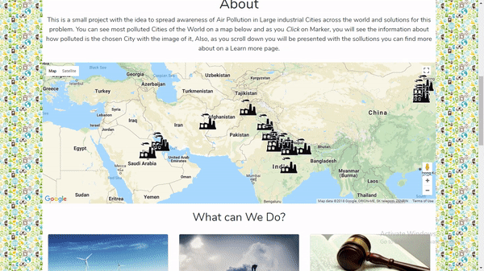

# polluted-cities-app
My first React JS project worked from the ground up

# Getting Started
First check if you have node js and npm installed
```
npm -v
```
If not, download the latest version of node js from https://nodejs.org/

Than, navigate to the catch-of-the-day-master folder in your command line and type:
```
npm install
```
Once that is done start the live server at localhost:3000
```
npm start
```
# About

This is a Website I did from wireframing, designing through coding and problem solving until the final touch with animations and styling.

## Basic Idea

Basic Idea was to make a Website with google maps api that will show information from data file in a separate component and making it a little interactive and educational. So, when you Click on a marker you will be provided with the info about the City.




## Building

In Planning, The biggest problem to face was connecting the data file with google maps api and it's markers and show it in a separate component. After a lot of research and experimentation I came up to use Redux,
A Great tool for storing states and dispatching it to whatever component is needed. 

# Other
Additional tools and elements used in a process of creation

1. Video - Used in Header
2. Router - For Routing to a certain page
3. Bootstrap - For more Neat UI
4. WoW.js - For Animation effect when scrolling
5. Responsive - Mobile Friendly

For any additional information you are free to ask, Also, I am open for colaboration of any kind concerning Web Development.
